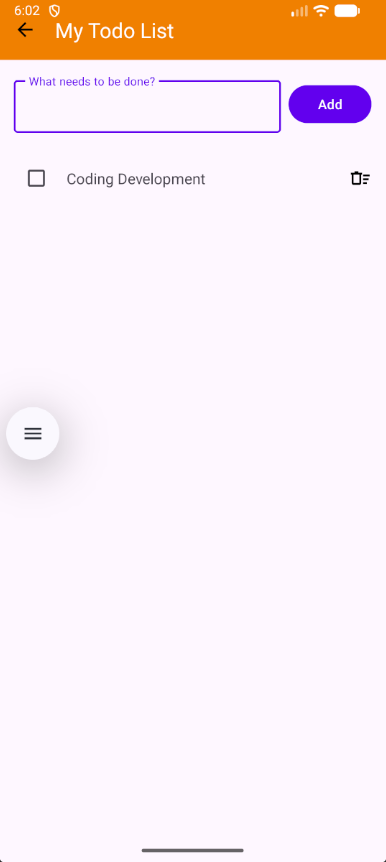
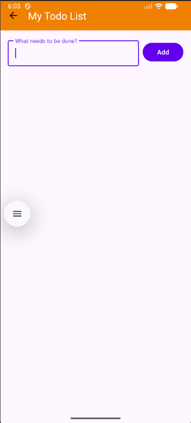

# Begginner Apps - Todo List

A simple, clean Todo List application built as part of the Beginner Apps collection. This app demonstrates core Android development concepts including UI design with Material components, RecyclerView management, and basic CRUD operations.

## Features

- **Add Tasks:** Quickly add new tasks using the input field.
- **Task Management:** Mark tasks as completed or delete them from your list.
- **Modern UI:** Built using Material Design components for a consistent and intuitive experience.
- **Efficient Lists:** Utilizes `RecyclerView` with a custom adapter for smooth performance.

## Screenshot

  
  

## Tech Stack

- **Language:** Kotlin
- **UI Framework:** XML (ConstraintLayout, Material Components)
- **Components:**
    - `RecyclerView` for displaying the list.
    - `MaterialToolbar` for the app bar.
    - `TextInputLayout` and `TextInputEditText` for user input.
    - `Snackbar` for user notifications.
    - `ViewBinding` (enabled in project)

## Getting Started

1. Clone this repository.
2. Open the project in Android Studio.
3. Build and run the app on an emulator or physical device.

## Project Structure

- `MainActivity.kt`: Handles the main UI logic, adapter setup, and user interactions.
- `TodoAdapter.kt`: Manages the data and view binding for the task list.
- `Todo.kt`: Data class representing a single todo item.
- `activity_main.xml`: The main layout of the application.
- `item_todo.xml`: Layout for individual todo items.

---
*This project is designed for learning and practicing Android fundamentals.*
